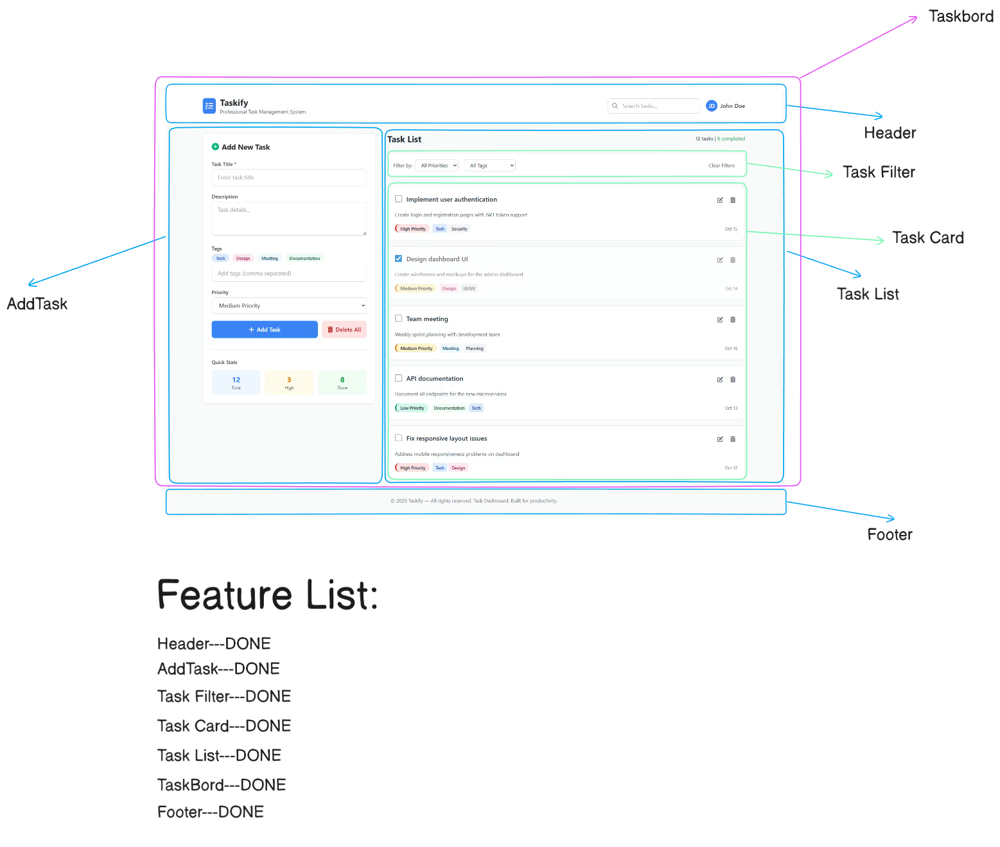

# Taskify — Professional Task Management System

Taskify is an easy-to-use task management system where users can create tasks, filter them, set priorities, and manage their task lists efficiently.
It’s lightweight but powerful — designed to boost productivity.

---

## 🌐 Live Demo

👉 **Live URL:** [https://taskify-system-pro.vercel.app](https://taskify-system-pro.vercel.app)


---

## 📸 Screenshot




---

## ✨ Features

* ✔ **Header** — Project name, search bar, and user profile
* ✔ **Add Task** — Title, description, tags, and priority input
* ✔ **Task Filter** — Filter by priority, status, or tags
* ✔ **Task Card** — Clean UI layout for each task
* ✔ **Task List** — Organized view of all tasks
* ✔ **Dashboard Layout (TaskBoard)** — Full board-style layout
* ✔ **Footer** — Copyright and project info

---

## 🧩 Components Overview

| Component    | Purpose                  |
| ------------ | ------------------------ |
| `Header`     | Branding + Search + User |
| `AddTask`    | Create and delete tasks  |
| `TaskFilter` | Filter tasks easily      |
| `TaskCard`   | UI block for each task   |
| `TaskList`   | Displays all tasks       |
| `TaskBoard`  | Main dashboard layout    |
| `Footer`     | Copyright section        |

---

## 🚀 Tech Stack

* React & Vite
* Tailwind CSS
* JavaScript (ES6+)

---

## 📦 Installation

```bash
git clone <repository-url>
cd taskify
npm install
npm run dev
```

---

## 📝 Usage

1️⃣ Create a new task using **Add Task**
2️⃣ View tasks in the list
3️⃣ Use **Filters** to quickly find tasks
4️⃣ Edit or delete tasks when necessary
5️⃣ Use priority levels to plan better

---


---

## 🔮 Future Improvements

* Drag & drop task sorting
* User authentication
* Dark mode
* Backend synchronization

---

## © License

© 2026 — Taskify. Built for productivity.
